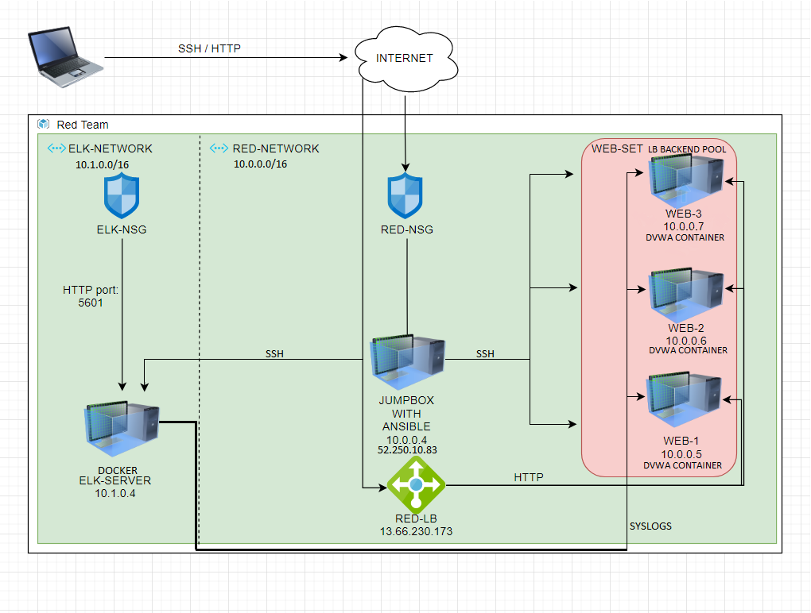
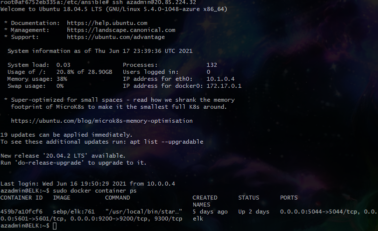

# UCSD_2021
Everything that I've done for my 2021 Bootcamp at UCSD for Sec+
## Automated ELK Stack Deployment

The files in this repository were used to configure the network depicted below.



These files have been tested and used to generate a live ELK deployment on Azure. They can be used to either recreate the entire deployment pictured above. Alternatively, select portions of the YAML file may be used to install only certain pieces of it, such as Filebeat or Metricbeat.


This document contains the following details:
- Description of the Topology
- Access Policies
- ELK Configuration
  - Beats in Use
  - Machines Being Monitored
- How to Use the Ansible Build

### Description of the Topology

The main purpose of this network is to expose a load-balanced and monitored instance of DVWA, the D*mn Vulnerable Web Application.

Load balancing ensures that the application will be highly avaliable, in addition to restricting in-bound access to the network.
- **Load balancers ensures that an applicaiton will be highly avaliable by distributing the loads to multiple machines**
- **Integrating an ELK server allows users to easily monitor the vulnerable VMs for changes to the JUMPBOX and system Intneral Network**
- **Filebeat is a lightweight shipper that monitors specific files or locations and ships them to either Elasticsearch or Logsearch**
- **Metricbeat is a lightweight shipper that monitors metrics from the operating system and ships the mto either Elasticsearch or Logsearch.**

The configuration details of each machine may be found below.

| Name           | Function   | IP Address | Operating System |
|----------------|------------|------------|------------------|
| Jump Box       | Gateway    | 10.0.0.4   | Linux            |
| WEB1           | Container  | 10.0.0.5   | Linux            |
| WEB2           | Container  | 10.0.0.6   | Linux            |
| WEB3           | Container  | 10.0.0.7   | Linux            |
| ELK-SERVER     | ELK Server | 10.1.0.4   | Linux            |

### Access Policies
The machines on the internal network are not exposed to the public Internet. 

Only the JUMPBOX machine can accept connections from the Internet. Access to this machine is only allowed from the following IP addresses:
- **52.250.10.83**

Machines within the network can only be accessed by JUMPBOX
- **MY PUBLIC IP**

A summary of the access policies in place can be found in the table below.

| Name      | Publicly Accessible | Allowed IP Addresses |
|-----------|---------------------|----------------------|
| Jump Box  | Yes                 | 52.250.10.83         |
|  WEB-1    | No                  | 10.1.0.4             |
|  WEB-2    | No                  | 10.1.0.4             |
|  WEB-3    | No                  | 10.1.0.4             |
| ELK-SERVER| No                  | 10.1.0.4             |


### Elk Configuration

Ansible was used to automate configuration of the ELK machine. No configuration was performed manually, which is advantageous because... 
- Ansible is free and open source and extremely powerful
- You don't need any other third party tools other than docker to run, which makes this an effiecent and somewhat lightweight tool.
- Anisble has a lot of very good documentation and is really easy to set up, needing very little programming knowledge when it comes to Playbooks

The playbook implements the following tasks:
- Install docker.io
- Install python3pip
- Increase virtual memory
- Download and install dockers
- Have the dockers run on boot

The following screenshot displays the result of running `docker ps` after successfully configuring the ELK instance.



### Target Machines & Beats
This ELK server is configured to monitor the following machines:
| Name   | IP Address |
|--------|------------|
| WEB-1  | 10.0.0.5   |
| WEB-2  | 10.0.0.6   |
| WEB-3  | 10.0.0.7   |

We have installed the following Beats on these machines:
- Filebeat
- Metricbeat
These Beats allow us to collect the following information from each machine:
 - Filebeat collects - collects data about files or file locations
 - Metricbeat collects - collects metric data about the operating system, such as hardware usage

### Using the Playbook
In order to use the playbook, you will need to have an Ansible control node already configured. Assuming you have such a control node provisioned: 

SSH into the control node and follow the steps below:
- Copy the **playbook.yml** file to **Ansible Control Module**.
- Update the **hosts** file to include...
```
$ cd /etc/ansible
$ cat > hosts
[webservers]
  10.0.0.5 ansible_python_interpreter=/usr/bin/python3
  10.0.0.6 ansible_python_interpreter=/usr/bin/python3
  10.0.0.7 ansible_python_interpreter=/usr/bin/python3
[elk]
  10.1.0.4 ansible_python_interpreter=/usr/bin/python3
```
- Run the playbook, and navigate to Kibana Filebeat and Metricbeat modules to check that the installation worked as expected.
```
cd /etc/ansible
  $ ansible-playbook install-elk.yml
  $ ansible-playbook install_metricbeat_and_filebeat-playbook.yml
```
- Playbook for Filebeat and Metricbeat are also here: [filebeat](Ansible/install_metricbeat_and_filebeat-playbook.yml)
- To update a specific machine on a playbook, you have to edit the hosts file to include the local IP addresses of the machines you want, You can also add a group name by putting the name of the group in brackets above the IPs, as shown as above. After that is done, in your playbook file where it calls for a host 
```
---
- name: Name of playbook
  hosts: [TARGET MACHINES]
  remote_user: azadmin
  become: true
  tasks:
```
- _Which URL do you navigate to in order to check that the ELK server is running?

**http://{YOUR ELK MACHINE IP}/app/kibana**

---
#### BONUS COMMANDS - PULL FROM THIS REPOSITORY

Pull install_elk-playbook.yml
```
curl -L -O https://raw.githubusercontent.com/briggsbastian/UCSD_CyberSec/main/Project-1/Ansible/install_elk-playbook.yml
```
Pull filebeat-config.yml
```
curl -L -O https://raw.githubusercontent.com/briggsbastian/UCSD_CyberSec/main/Project-1/Ansible/filebeat-config.yml
```
Pull Metricbeat and Filebeat installer 
```
curl -L -O https://raw.githubusercontent.com/briggsbastian/UCSD_CyberSec/main/Project-1/Ansible/install_metricbeat_and_filebeat-playbook.yml
```
